<div align="center">


# WKangaroo Bookstore

Nền tảng bán sách B2C kết nối storefront, quy trình mua hàng, thanh toán và dashboard quản trị trong một hệ thống.

<p>
  
  
  
  
  
</p>

[Khám phá sản phẩm](#product-tour) · [Kiến trúc](#kiến-trúc-và-các-quyết-định-kỹ-thuật) · [Chạy local](#chạy-local)

</div>

<p align="center">
  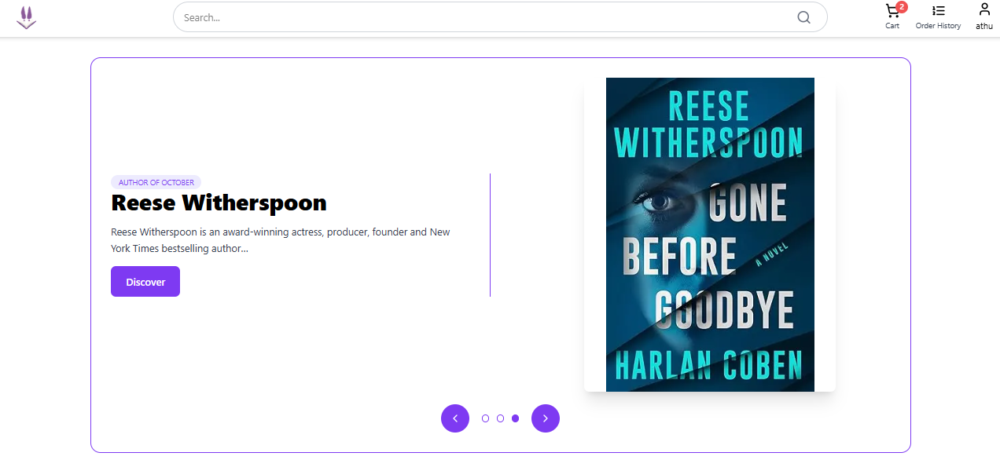
</p>

<p align="center"><sub>Storefront · Danh mục sách · Trải nghiệm mua sắm</sub></p>

## Tại sao có WKangaroo?

Một website nhà sách cần làm tốt hai việc cùng lúc: giúp khách hàng tìm và mua sách thuận tiện, đồng thời giúp đội ngũ cửa hàng quản lý danh mục, đơn hàng và doanh thu. WKangaroo triển khai hai luồng đó trên cùng một nền tảng, với frontend Next.js và REST API Laravel tách biệt.

### Những gì sản phẩm xử lý

| Mua sắm                                          | Vận hành                                                   |
| ------------------------------------------------ | ---------------------------------------------------------- |
| Duyệt và tìm kiếm sách; xem chi tiết sản phẩm    | Quản lý sách, khách hàng, nhân viên và tài khoản           |
| Đăng ký/đăng nhập; quản lý hồ sơ và địa chỉ      | Tra cứu đơn hàng; cập nhật trạng thái đơn và thanh toán    |
| Thêm vào giỏ, chỉnh số lượng, đặt hàng           | Theo dõi số liệu kinh doanh qua dashboard và biểu đồ       |
| Thanh toán qua VNPay; xem kết quả và lịch sử đơn | Phân quyền truy cập theo vai trò trong các luồng nghiệp vụ |

## Product tour

### 01 · Khám phá và chọn sách

Khách hàng xem danh mục, tìm kiếm theo tên và mở trang chi tiết trước khi thêm sách vào giỏ.

<p align="center">
  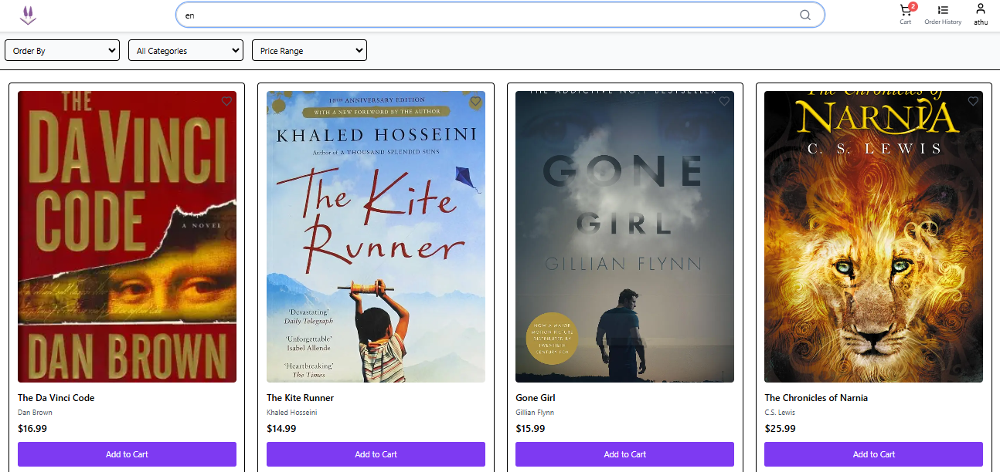
  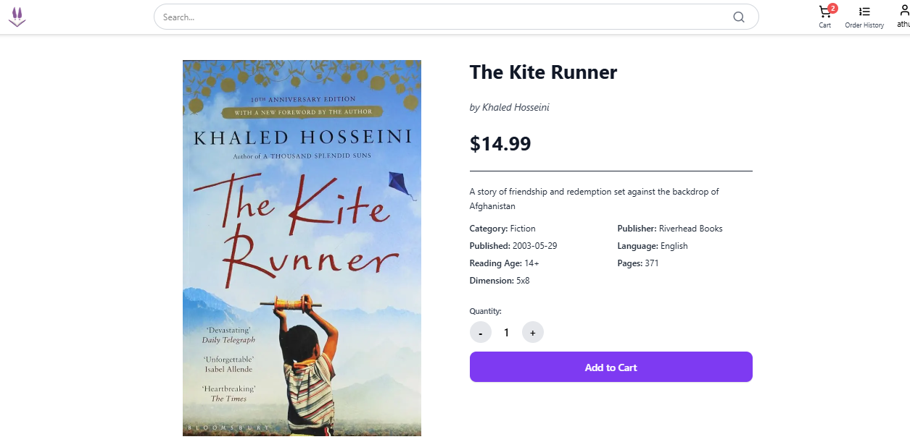
</p>

### 02 · Từ giỏ hàng đến thanh toán

Giỏ hàng cho phép thay đổi số lượng; backend kiểm tra tồn kho khi đặt hàng. Luồng VNPay có bước tạo giao dịch, trang nhận kết quả và IPN để cập nhật trạng thái thanh toán.

<p align="center">
  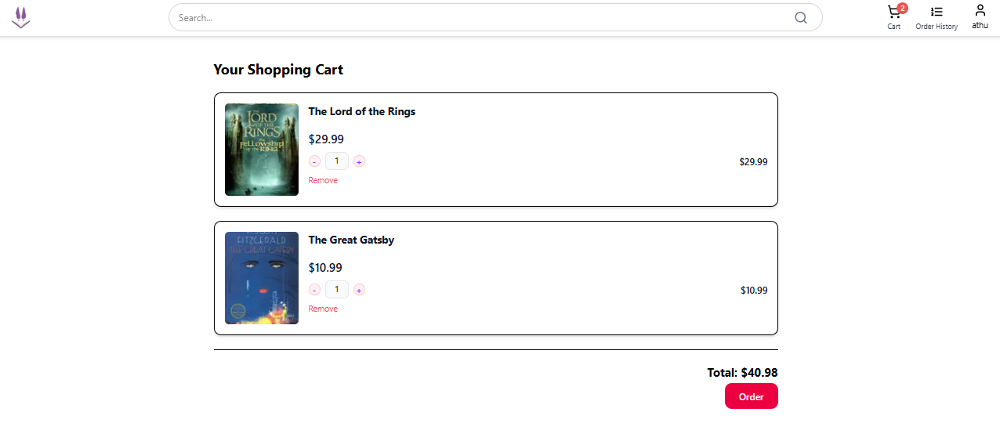
  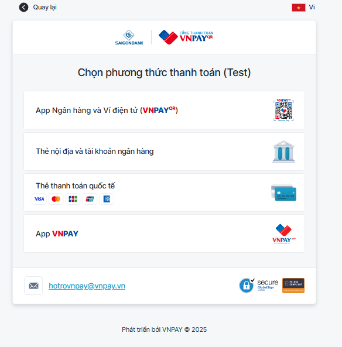
</p>

<p align="center">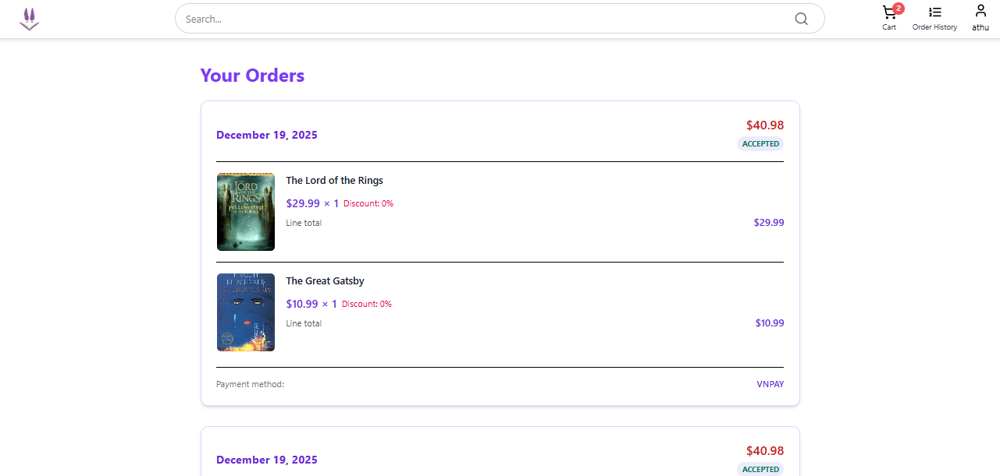</p>

### 03 · Một dashboard để vận hành cửa hàng

Khu vực quản trị tập trung dữ liệu đơn hàng, sản phẩm và khách hàng. Dashboard hiển thị chỉ số tổng quan cùng biểu đồ doanh thu, đơn theo ngày và sản phẩm.

<p align="center">
  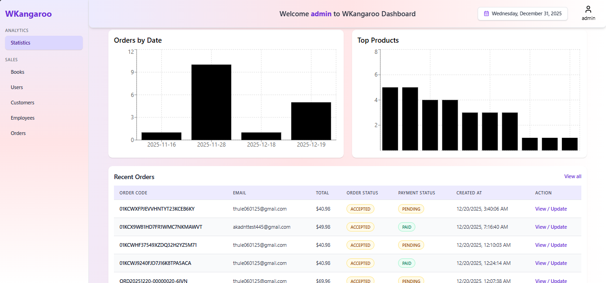
  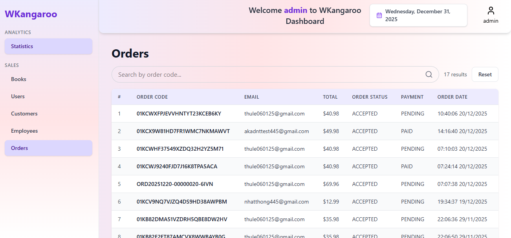
</p>

<details>
<summary><b>Xem thêm giao diện quản trị</b></summary>
<br />
<p align="center">
  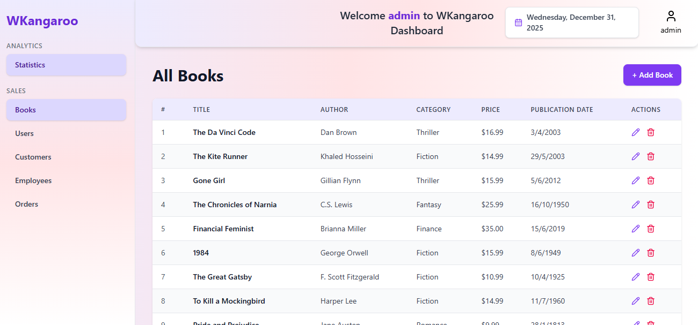
  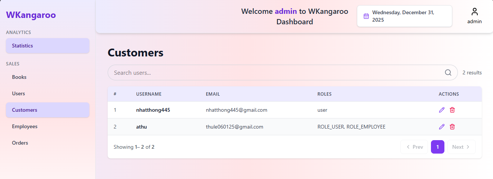
</p>
</details>

## Kiến trúc và các quyết định kỹ thuật

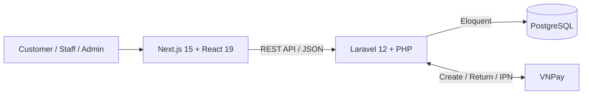

- **Frontend:** Next.js App Router + TypeScript; trang khách hàng và khu vực quản trị dùng các thành phần giao diện riêng. Recharts trực quan hóa dữ liệu trên dashboard.
- **Backend:** Laravel REST API xử lý sách, người dùng, địa chỉ, giỏ hàng, đơn hàng và thanh toán. Migrations quản lý cấu trúc dữ liệu; Eloquent xử lý truy vấn.
- **Xác thực và vai trò:** API sử dụng JWT; các controller kiểm tra quyền truy cập cho các thao tác nghiệp vụ. Package Laravel Sanctum có trong backend cho tuyến API tương ứng.
- **Tính toàn vẹn đơn hàng:** backend kiểm tra giỏ hàng, địa chỉ và số lượng tồn trước khi tạo đơn; thanh toán VNPay xử lý phản hồi và IPN.
- **Cấu hình triển khai:** frontend và backend có biến môi trường riêng; backend có Dockerfile. Repo hỗ trợ PostgreSQL, với cấu hình kết nối do môi trường cung cấp.

<details>
<summary><b>Tech stack chi tiết</b></summary>
<br />

| Lớp          | Công nghệ                                               |
| ------------ | ------------------------------------------------------- |
| Web          | Next.js 15, React 19, TypeScript 5, Tailwind CSS 4      |
| Biểu đồ & UI | Recharts, Flowbite React, Lucide React, react-hot-toast |
| API          | Laravel 12, PHP 8.2+, Eloquent ORM, JWT                 |
| Dữ liệu      | PostgreSQL; migrations và seeders                       |
| Thanh toán   | VNPay sandbox/API callback                              |

</details>

## Chạy local

**Cần có:** Node.js 20, PHP 8.2+, Composer 2 và PostgreSQL. Frontend chạy ở `localhost:3001`, API chạy ở `localhost:8080`.

### 1. Backend

```bash
git clone https://github.com/AkaDNT/BookStore_IS207.git
cd BookStore_IS207/backend
composer install
```

Sao chép `backend/.env.example` thành `backend/.env`, rồi cập nhật tối thiểu:

```env
APP_URL=http://localhost:8080
DB_CONNECTION=pgsql
DB_HOST=127.0.0.1
DB_PORT=5432
DB_DATABASE=bookstore
DB_USERNAME=postgres
DB_PASSWORD=your_local_password
```

Tạo database `bookstore` trong PostgreSQL trước khi migrate. Từ thư mục `backend`:

```bash
php artisan key:generate
php artisan jwt:secret
php artisan migrate
php artisan db:seed
php artisan serve --host=0.0.0.0 --port=8080
```

### 2. Frontend

Mở terminal khác tại thư mục `web-app`:

```bash
npm install
```

Tạo `web-app/.env.local`:

```env
NEXT_PUBLIC_BASE_URL=http://localhost:3001
NEXT_PUBLIC_API_URL=http://localhost:8080/api
API_URL=http://localhost:8080/api
```

```bash
npm run dev
```

Truy cập **http://localhost:3001**. Để thử thanh toán VNPay, cấu hình thêm `VNP_TMN_CODE`, `VNP_HASH_SECRET`, `VNP_URL`, `VNP_RETURN_URL` và `VNP_IPN_URL` ở backend; IPN cần một URL HTTPS công khai.

## Cấu trúc mã nguồn

```text
backend/                    Laravel API, controllers, models, migrations, seeders
web-app/app/(user)/         Storefront và luồng mua hàng
web-app/app/(dashsboard)/   Dashboard và màn hình quản trị
web-app/public/assets/      Ảnh bìa sách
docs/screenshots/           Ảnh giao diện sản phẩm
```

<p align="center"><b>WKangaroo · Book discovery, checkout and store operations in one application.</b></p>
